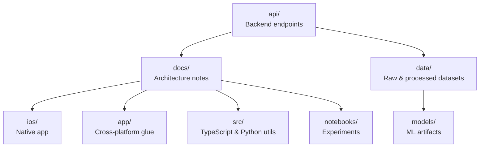

# Developer Guide

This guide outlines contribution practices, repository structure, and development workflows.

## Contribution workflow
1. Create a feature branch from `main` using a descriptive name (e.g., `feature/data-pipeline`).
2. Keep commits small and focused; use present-tense, imperative messages (e.g., `Add data loader for plant images`).
3. Run relevant checks locally before opening a pull request (linting, unit tests, and notebook execution where applicable).
4. Open a pull request with:
   - Summary of changes and testing performed.
   - Notes on data files added/modified (avoid committing large raw datasets; prefer references under `data/raw`).
5. Request review from a teammate; address feedback with follow-up commits instead of force pushes when possible.

## Code style and testing
- **Python**: follow PEP 8; type hints encouraged. Place preprocessing scripts under `src/python/` and notebooks under `notebooks/`.
- **TypeScript/Node**: keep utilities in `src/` with clear module boundaries; lint before committing.
- **iOS/Swift**: keep features in scene-based folders, separate view, view-model, and service code; prefer SwiftLint defaults if available.
- Add or update tests whenever business logic changes. For data pipelines, include small sample fixtures rather than full datasets.

## Repository structure diagram
The project is organized by platform and role. Use this as a navigation aid when adding or locating code.

## Tips for working with data
- Keep original downloads in `data/raw/` and treat them as read-only inputs.
- Save derived artifacts (e.g., resized images, CSVs) to `data/processed/` with clear filenames and short README notes when schemas change.
- If you need to share large files, prefer external storage (Kaggle, object storage) and commit pointers or scripts for reproduction.
